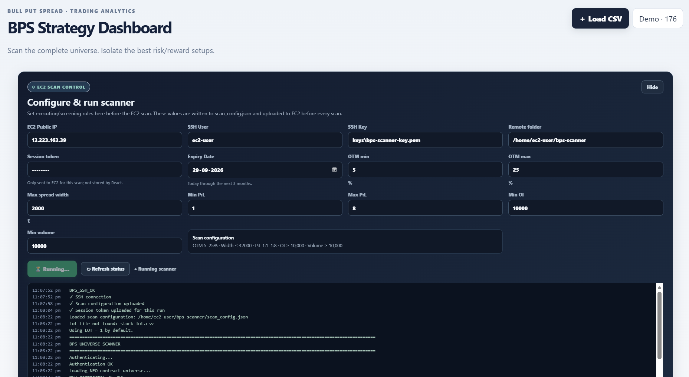
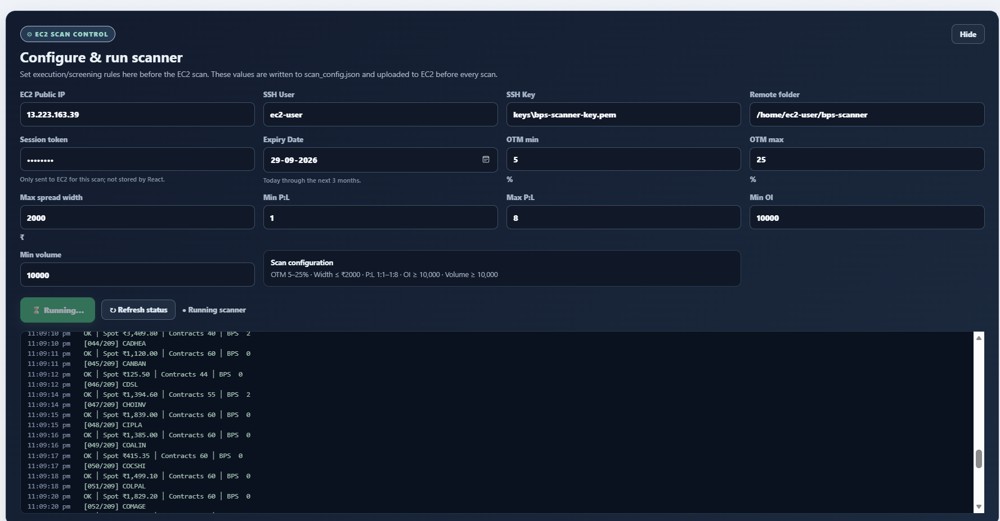
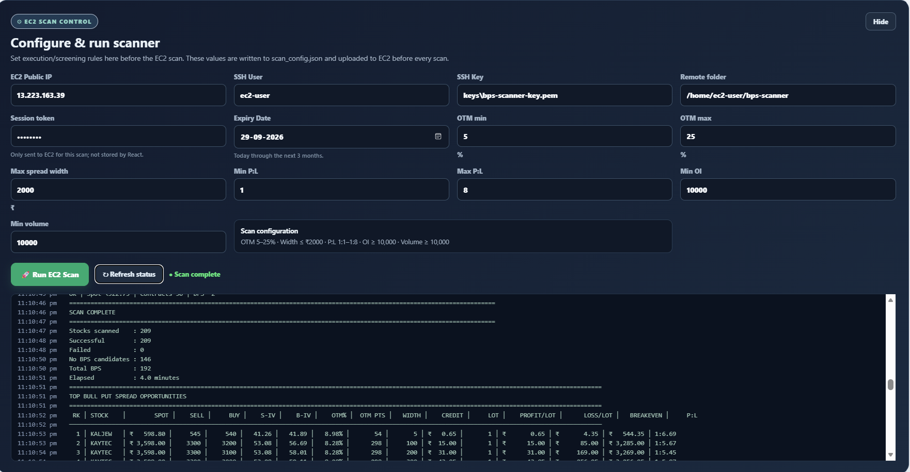
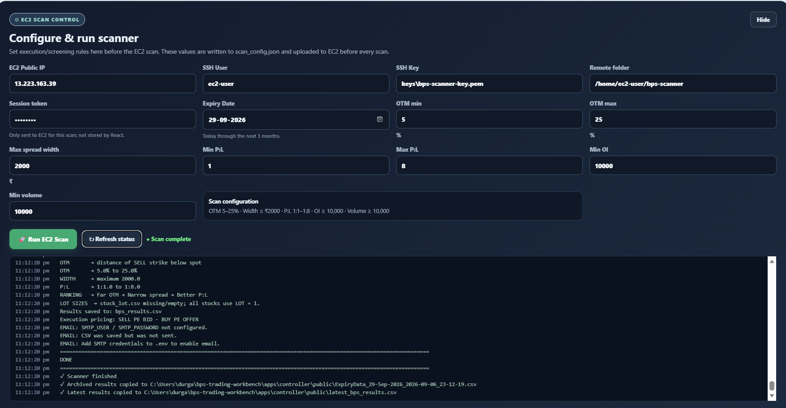
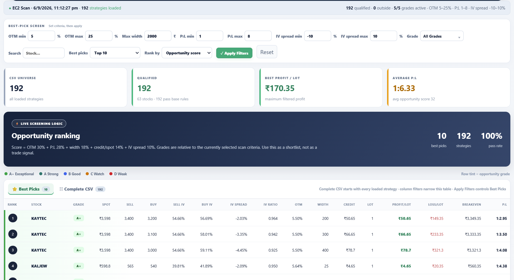
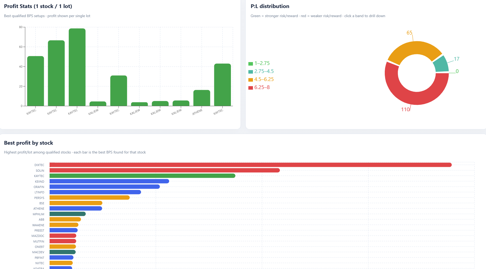
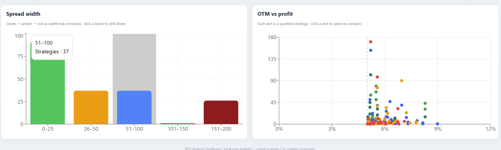

# BPS Trading Workbench

BPS Trading Workbench is a Bull Put Spread opportunity tracker for options
screening and analysis. It runs the market-data scanner on an EC2 instance and
provides a Windows dashboard for configuring a scan, reviewing the returned
opportunities, ranking setups, and exploring the resulting CSV locally.

The application is intended for research and screening. It does not place
orders or provide investment advice.

## Screenshots

The screenshots below show the dashboard workflow, scanner configuration, and
results analysis views.









## What It Does

The scanner evaluates Bull Put Spread opportunities for a selected expiry date.
The dashboard limits the expiry selector to today through a maximum of three
months ahead.

Before each scan, the user can configure:

- Expiry date
- Minimum OTM percentage
- Maximum OTM percentage
- Maximum spread width
- Minimum Profit:Loss ratio
- Maximum Profit:Loss ratio
- Minimum open interest
- Minimum volume
- Optional IV spread and grade filters in the dashboard

The scanner uses executable-side option prices:

- Sell the higher-strike put at its bid
- Buy the lower-strike put at its offer
- Credit = sell bid - buy offer

The result includes strikes, spot price, bid/offer quotes, implied volatility,
OTM distance, spread width, credit, lot size, maximum profit, maximum loss,
breakeven, and Profit:Loss ratio.

The dashboard can rank and filter opportunities by the current screening
universe. Scanner results are ranked primarily by farther OTM distance, then
sell-leg IV, narrower spread width, and Profit:Loss ratio. The dashboard also
calculates a score and grade for easier comparison.

## Architecture

```text
Windows React/Vite dashboard
        |
        v
Windows Node controller
        |
        | SSH/SCP
        v
EC2 Python scanner -> bps_results.csv
        |
        | SCP result download
        v
Windows dashboard
```

Windows owns the UI and controller. EC2 owns the Python scanner and its Python
virtual environment. The UI and controller are not deployed to EC2.

## Requirements

Install or have available on Windows:

- Git
- Node.js and npm
- Windows OpenSSH (`ssh` and `scp`)
- AWS CLI v2
- An EC2 SSH private key in PEM format

The EC2 instance must have:

- Amazon Linux or another Linux distribution with Python 3
- Network access to the Breeze API
- An SSH security-group rule for TCP port 22
- A Python virtual environment created by the deployment script

## Clone And Configure

Clone the public repository:

```powershell
git clone https://github.com/pratapani/bps-trading-workbench.git
cd bps-trading-workbench
```

Install the Windows dashboard dependencies:

```powershell
npm.cmd run install:web
```

Create the local deployment configuration:

```powershell
Copy-Item .env.example .env
```

Edit `.env` and set the actual EC2 and AWS values:

```env
BPS_EC2_HOST=13.223.163.39
BPS_EC2_INSTANCE_ID=i-your-instance-id
BPS_EC2_USER=ec2-user
BPS_EC2_KEY_PATH=C:\path\to\bps-scanner-key.pem
BPS_EC2_REMOTE_DIR=/home/ec2-user/bps-scanner
BPS_EC2_SECURITY_GROUP_ID=sg-your-security-group-id
BPS_AWS_REGION=us-east-1
BPS_CONTROLLER_PORT=8787
```

`.env` is ignored by Git. Do not commit it.

The SSH key can be stored in an ignored project folder such as:

```text
keys/bps-scanner-key.pem
```

The `.pem` file is ignored by Git. Do not commit it or place it in a public
repository.

## AWS CLI Setup

The startup preflight uses the AWS EC2 API. Configure the AWS CLI once on
Windows using an IAM identity or SSO profile:

```powershell
aws configure
```

Use `us-east-1` or the region where the EC2 instance exists. For SSO:

```powershell
aws configure sso
aws sso login
```

Verify authentication:

```powershell
aws sts get-caller-identity
```

The required permissions are:

```text
ec2:DescribeInstances
ec2:StartInstances
ec2:DescribeSecurityGroups
ec2:AuthorizeSecurityGroupIngress
```

Use a least-privilege IAM identity for this workflow. Avoid using the AWS root
account for routine development.

## Daily Startup

Start the controller and dashboard with one command:

```powershell
npm.cmd start
```

The startup sequence is:

1. Read the EC2 instance ID and AWS region from `.env`.
2. Check the EC2 instance state.
3. Start the instance if it is stopped.
4. Wait until the instance reaches `running`.
5. Resolve the instance's current public IP.
6. Get the current Windows public IP from `https://api.ipify.org`.
7. Check the configured security group's TCP/22 inbound rules.
8. Add the current Windows IP as `<ip>/32` when it is missing.
9. Start the Node controller on `127.0.0.1:8787`.
10. Start the Vite dashboard on `http://localhost:5173/`.

The startup check does not remove old IP rules. This avoids unexpectedly
disconnecting another approved workstation; old rules can be removed manually
from AWS when no longer needed.

If the controller is already running on port 8787, the launcher reuses it
instead of starting a duplicate process.

## Run A Scan

After the dashboard opens:

1. Enter a fresh Breeze session token in the scan panel.
2. Select an expiry date from today through the next three months.
3. Set OTM, spread width, Profit:Loss, open-interest, and volume limits.
4. Start the scan.

The Windows controller uploads the scan configuration and the UI-entered
session token to EC2 over SCP. The EC2 scanner reads the uploaded token for that
run, authenticates with Breeze, runs the scanner, and writes `bps_results.csv`.
The controller copies the result back to Windows as a timestamped archive and
updates `latest_bps_results.csv` for the dashboard.

The temporary session-token file is removed by the scanner after it is read. If
no UI token is uploaded, the scanner can fall back to
`BREEZE_SESSION_TOKEN` from the EC2-side `.env`.

## Deploy Scanner Changes

Deployment is separate from daily UI startup. Run it after changing the Python
scanner or its runtime configuration:

```powershell
npm.cmd run deploy:scanner
```

The deployment sequence is:

1. Check and start the EC2 instance when necessary.
2. Resolve its current public IP.
3. Connect with Windows SSH.
4. Create a timestamped ZIP backup of existing active scanner files.
5. Upload `bps_engine.py`, `scan_universe.py`, `scan_config.json`, and
   `requirements.txt`.
6. Create or update the EC2 `.venv`.
7. Install the Python requirements.

Backups are stored on EC2 under:

```text
/home/ec2-user/bps-scanner/backups/scanner-YYYYMMDD-HHMMSS.zip
```

The deployment does not upload credentials, UI dependencies, archived scripts,
or generated results.

To run the deployment script directly:

```powershell
powershell -ExecutionPolicy Bypass -File scripts\deploy-scanner.ps1
```

## Tests

The repository currently has eight dependency-free Python unit tests for the
BPS engine:

```powershell
npm.cmd run test:python
```

The tests cover normal-distribution and Black-Scholes calculations, executable
bid/offer pricing, invalid spreads, liquidity and OTM filters, invalid spot
input, and ranking behavior.

The live Breeze scan, AWS security-group update, SSH connection, and EC2
deployment are integration operations and require real credentials and network
access. They are not run by the unit-test command.

## Useful Commands

```powershell
# Install dashboard dependencies
npm.cmd run install:web

# Build the dashboard
npm.cmd run build

# Start controller only
npm.cmd run controller

# Start UI and controller with EC2 preflight
npm.cmd start

# Deploy scanner to EC2
npm.cmd run deploy:scanner

# Run Python unit tests
npm.cmd run test:python
```

## Project Structure

```text
apps/
  controller/
    controller.mjs              Windows HTTP controller and SSH runner
    public/                      Downloaded and sample result files
  web/
    src/main.jsx                 React dashboard
    src/styles.css               Dashboard styles
    public/                      Browser demo assets
services/
  scanner/
    bps_engine.py                BPS calculations and screening
    scan_universe.py             Breeze universe scanner
    scan_config.json             Scanner defaults
    requirements.txt              EC2 Python dependencies
scripts/
  ensure-ec2-instance.ps1        EC2 start/status/IP preflight
  ensure-ssh-access.ps1          Windows IP/security-group preflight
  deploy-scanner.ps1             EC2 backup and scanner deployment
  start-local.ps1                One-command local launcher
tests/
  test_bps_engine.py             Python unit tests
data/samples/                    Sample CSV inputs
```

## Security And Operational Notes

- Never commit `.env`, AWS credentials, Breeze credentials, session tokens, or
  PEM private keys.
- Rotate credentials immediately if they are exposed.
- Use an IAM identity with only the permissions required by this workflow.
- A stopped EC2 instance may receive a different public IP after starting; the
  startup and deployment preflights resolve the current address from the
  instance ID.
- An Elastic IP avoids changing the EC2 address, but the startup check still
  refreshes the address for correctness.
- Keep the controller bound to localhost unless remote access is deliberately
  configured.
